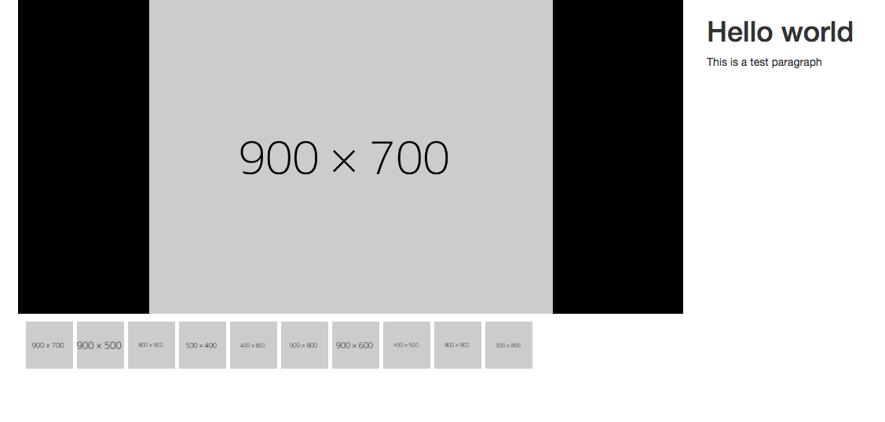
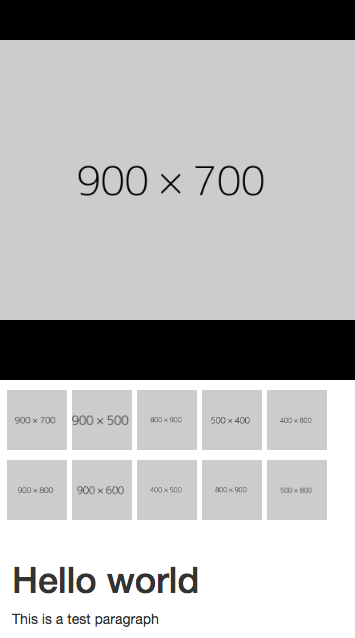

# React Image Lightbox Fit

## Example

```jsx
import React from 'react';
import { render } from 'react-dom';
import LightBoxFit from 'react-image-lightbox-fit';

const App = () => (
  <div>
    <div className="visible-xs visible-sm">
      <LightBoxFit images={['https://dummyimage.com/300x500']} height={400} />
    </div>
    <div className="container">

      <div className="row">
        <div className="col-md-9 hidden-xs hidden-sm">
          <LightBoxFit 
            images={[
              'https://dummyimage.com/300x500',
              'https://dummyimage.com/400x300',
              ]} 
            height={400} 
          />
        </div>
        <div className="col-md-3">
          <h1>Hello world</h1>
          <p>This is a test paragraph</p>
        </div>
      </div>
    </div>
  </div>

);

render(<App />, document.getElementById('root'));
```

### Props
```js
ReactImageLightboxFit.propTypes = {
  height: PropTypes.number.isRequired,
  images: PropTypes.arrayOf(PropTypes.string).isRequired,
};
```

## Result 
### Desktop


### Mobile



## Dev Mode
1. Clone this repository
1. Run `yarn install` (Usage of Yarn is recommended)
1. Edit the `src/index.jsx` file and then run `npm run dev`.  
1. This will start the `webpack-dev-server` 
1. Then open your browser at `localhost:3100`
1. The browser will be updated everytime you change the code at `src/index.jsx`

## Dev Features
* Linting with eslint
* Linting code style: Airbnb
* Testing with `jest@^21.2.1` and `enzyme@^3.1.1`
* Uses `babel` for JS transpiling
* Uses `webpack` for building the code

## Folder structure
* `/src`: The module code
* `/test`: The tests for the `src` components
* `/build`: The target compilation directory

## Credits
Juan Camilo Guarín Peñaranda  
[Otherwise SAS](https://github.com/owsas)  
Cali, Colombia, 2017

## License
MIT
